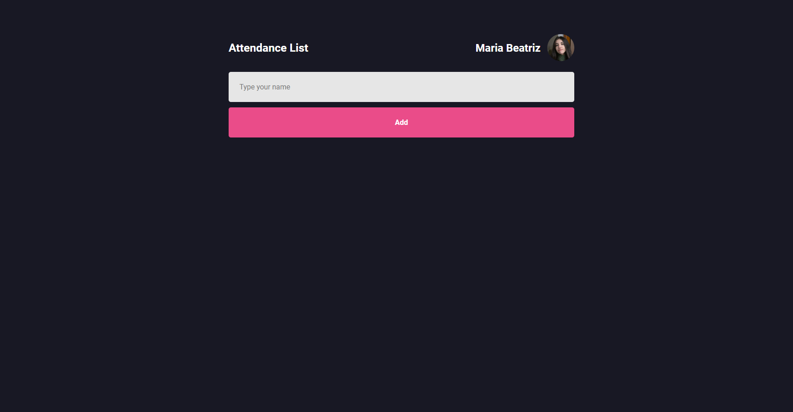

<h1 align="center"> Attendance List </h1>

<h1 align="center">
  
</h1>

# About the project

[Attendance List](https://react-app-beatriznaufel.vercel.app) is my first project using ReactJS.

# Techs

- [HTML](https://www.w3schools.com/html/)
- [CSS](https://www.w3schools.com/css/)
- [JavaScript](https://developer.mozilla.org/pt-BR/docs/Web/JavaScript)
- [ReactJS](https://reactjs.org/)

# Install
Clone this repository and install it dependencies with this command: 
```sh
$ yarn install
```

# Running
Run the application with `yarn dev` command, it will start the app:
```sh
$ yarn dev

